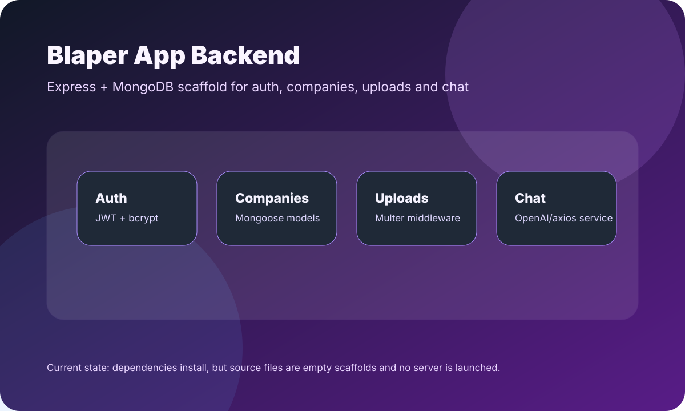

# Blaper App Backend

Backend inicial para Blaper App, planteado como API Express con MongoDB/Mongoose, autenticación JWT, carga de archivos y servicio de chat.

<p align="center">
  
</p>

## Estado Actual

Este repositorio contiene la estructura de carpetas y dependencias del backend, pero los archivos fuente dentro de `backend/src/` están vacíos. Todavía no hay endpoints implementados ni servidor Express arrancando.

## Stack Declarado

- Node.js
- Express
- Mongoose
- bcryptjs
- jsonwebtoken
- dotenv
- cors
- multer
- axios

## Estructura

```text
backend/package.json          # Scripts y dependencias
backend/src/app.js            # Entrada de la app, actualmente vacía
backend/src/config/           # Configuración de base de datos
backend/src/controllers/      # Controladores auth/chat/company
backend/src/middleware/       # Auth y upload middleware
backend/src/models/           # Modelos User y Company
backend/src/routes/           # Rutas auth/chat/company
backend/src/services/         # Servicio de chat
```

## Instalación

```bash
cd backend
npm ci
```

## Ejecución

```bash
npm start
```

> Nota: actualmente `npm start` ejecuta `node src/app.js`, pero `src/app.js` está vacío; por lo tanto el proceso termina sin levantar un servidor HTTP.

## Validación Local

Validación realizada durante esta actualización:

```bash
cd backend
npm ci
npm start
```

Resultado:

- Las dependencias se instalaron correctamente.
- `npm start` finalizó sin errores, pero no levantó servicio porque la entrada está vacía.
- No se tomó captura de runtime porque no hay servidor ni UI ejecutable todavía.

## Próximos Pasos Sugeridos

1. Implementar `src/app.js` con Express, middlewares y rutas.
2. Agregar conexión MongoDB en `src/config/database.js`.
3. Implementar modelos, controladores y rutas.
4. Agregar `.env.example`.
5. Agregar tests básicos de API.
